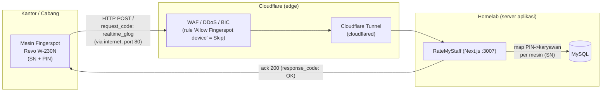
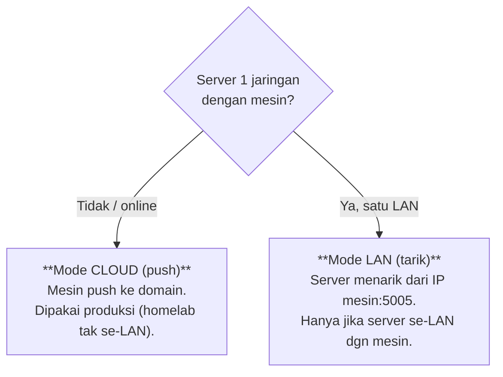
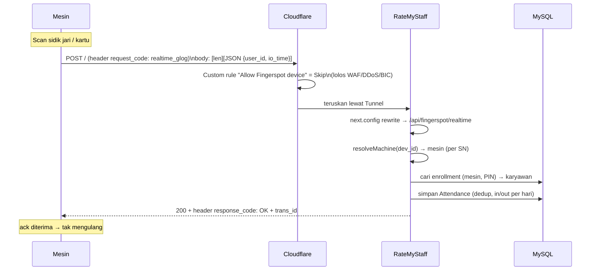
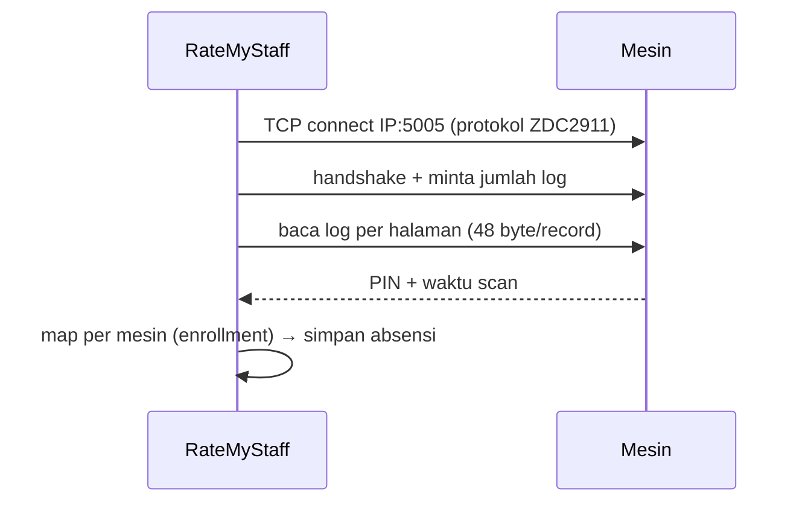
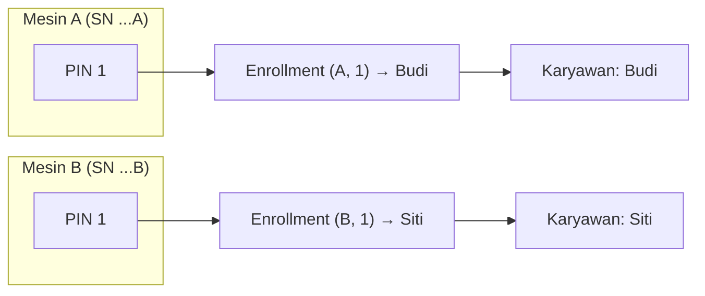
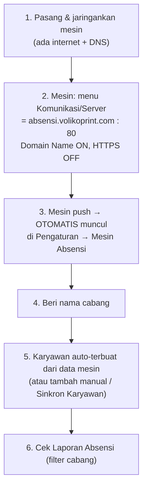
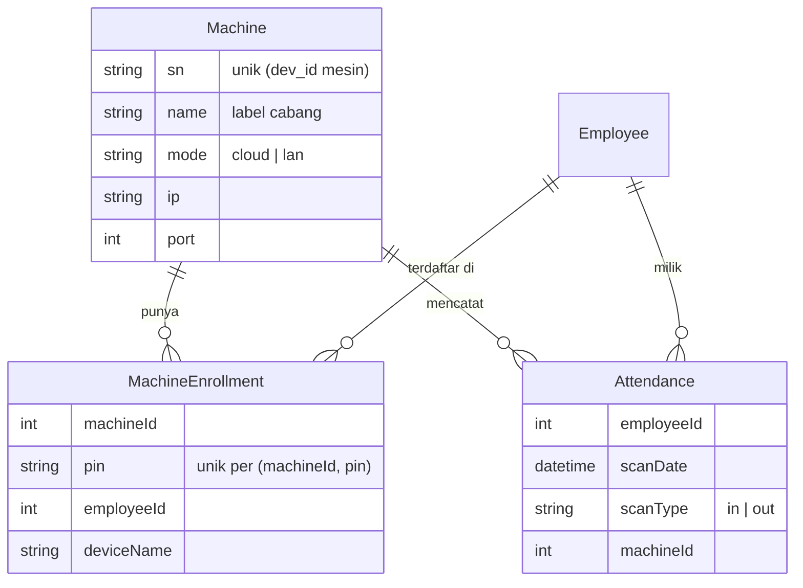

# Integrasi Mesin Absensi Fingerspot (Revo W‑230N) — Panduan & Arsitektur

> Dokumen ini merangkum hasil reverse‑engineering dan integrasi mesin absensi
> **Fingerspot Revo W‑230N** ke RateMyStaff — **tanpa** aplikasi/DLL bawaan
> Fingerspot. Ditulis setelah sesi panjang mengulik protokol mesin, Cloudflare,
> dan multi‑cabang. Simpan sebagai rujukan saat memasang mesin baru.

Daftar isi:
- [Ringkasan](#ringkasan)
- [Arsitektur besar](#arsitektur-besar)
- [Dua cara mesin terhubung: Cloud vs LAN](#dua-cara-mesin-terhubung-cloud-vs-lan)
- [Alur Cloud (push) — yang dipakai produksi](#alur-cloud-push--yang-dipakai-produksi)
- [Alur LAN (tarik langsung)](#alur-lan-tarik-langsung)
- [Multi‑mesin / multi‑cabang](#multi-mesin--multi-cabang)
- [Cara memasang mesin baru](#cara-memasang-mesin-baru)
- [Yang harus diatur di MESIN](#yang-harus-diatur-di-mesin)
- [Yang harus diatur di CLOUDFLARE (sekali)](#yang-harus-diatur-di-cloudflare-sekali)
- [Protokol teknis (ringkas)](#protokol-teknis-ringkas)
- [Model data](#model-data)
- [Troubleshooting](#troubleshooting)
- [File terkait](#file-terkait)

---

## Ringkasan

Mesin Revo W‑230N (berbasis **Realand ZDC2911**) mengirim data absensi secara
**realtime** ke server memakai protokol HTTP proprietary Fingerspot (RealSvr).
RateMyStaff menerima, memetakan **PIN → karyawan (per mesin)**, dan menyimpan
absensi — semua tanpa software Fingerspot.

- **PIN + nama karyawan ada di mesin** dan bisa ditarik.
- **In/out** ditentukan dari urutan waktu per hari (benar untuk shift pagi/siang/malam).
- **Multi‑cabang**: tiap mesin dikenali dari **SN (dev_id)**; PIN unik per mesin,
  jadi dua cabang boleh pakai PIN sama tanpa bentrok.

---

## Arsitektur besar

Poin penting: **mesin yang menelepon KELUAR** (push). Server tak perlu menjangkau
jaringan kantor — cocok untuk banyak cabang di lokasi berbeda.

---

## Dua cara mesin terhubung: Cloud vs LAN

| | Cloud (push) | LAN (tarik) |
|---|---|---|
| Arah koneksi | Mesin → server | Server → mesin (IP:5005) |
| Syarat jaringan | Mesin punya internet | Server & mesin satu LAN |
| Cocok untuk | Banyak cabang / online | Server on‑premise |
| Setup di app | Otomatis muncul saat push | Tambah mesin + IP di Pengaturan |
| Realtime? | Ya | Tidak (perlu tarik manual/terjadwal) |

---

## Alur Cloud (push) — yang dipakai produksi

Jenis request yang dikirim mesin:
- `realtime_glog` → **scan absensi** (`user_id`=PIN, `io_time`=YYYYMMDDHHMMSS).
- `realtime_enroll_data` → **data user** (`user_id`, `user_name`) → auto buat/label karyawan.
- `receive_cmd` / `send_cmd_result` → polling perintah (cukup di‑ack).

> ⚠️ **Ack wajib benar**: HTTP 200, **body kosong**, header `response_code: OK`
> + `trans_id` di‑echo. Kalau salah, mesin retry terus (ikon cloud tanda seru).

---

## Alur LAN (tarik langsung)

Dipakai lewat **Pengaturan → Mesin Absensi → (mesin LAN) → Tarik Absensi**.
Hanya berhasil bila server berada di jaringan yang bisa menjangkau `IP:5005`.

---

## Multi‑mesin / multi‑cabang

Pemetaan PIN **per mesin** (bukan global), sehingga PIN sama di cabang berbeda
= orang berbeda.

- Mesin **otomatis terdaftar** saat push pertama (dikenali dari SN).
- Di **Pengaturan → Mesin Absensi (Cabang)**: beri **label cabang**, hapus, atau
  (untuk mesin LAN) tarik manual.
- Di **Laporan Absensi**: filter **Mesin / Cabang** muncul otomatis bila ada > 1 mesin.

---

## Cara memasang mesin baru

Untuk **mesin LAN** (server se‑LAN): di **Pengaturan → Mesin Absensi → + Tambah
Mesin → LAN**, isi IP + port, lalu **Tarik Absensi / Sinkron Karyawan**.

---

## Yang harus diatur di MESIN

Menu **Komunikasi → Server Cloud / ADMS / Web‑Server** (nama menu bisa beda):

| Setting | Nilai |
|---|---|
| Mode / Domain Name | **ON** (pakai nama domain, bukan IP) |
| Server Address | `absensi.volikoprint.com` |
| Server Port | `80` |
| HTTPS / SSL | **OFF** |
| Proxy | OFF |
| Jaringan (Ethernet) | IP, Gateway, **DNS** (mis. `8.8.8.8`) terisi |
| SN | biarkan bawaan mesin |

> Jangan pakai menu **Fingerspot.io / RevoTime.id / Cloud ID** — itu ke server
> pabrik Fingerspot, bukan server kita. Gunakan menu **Server/ADMS** biasa.

---

## Yang harus diatur di CLOUDFLARE (sekali)

Header `request_code` yang dikirim mesin diblokir proteksi bawaan Cloudflare.
Agar lolos (paket **gratis**):

1. **DDoS**: Security → Settings → HTTP DDoS → **Configure overrides** →
   Ruleset **sensitivity: Essentially Off**.
2. **WAF Custom Rule** (Security → Security rules → Custom rules → Create):
   - Expression: `any(http.request.headers["request_code"][*] ne "")`
   - Action: **Skip** → centang **semua** komponen (managed rules, Super Bot Fight
     Mode, **Browser Integrity Check**, User Agent Blocking, Security Level, dll).
3. Bot Fight Mode: **OFF**.

> Jangan hapus rule & override ini — itu yang meloloskan traffic mesin.

---

## Protokol teknis (ringkas)

**Realtime (push, port 80/HTTP):**
- Mesin `POST /` dgn header `request_code`, `trans_id`, `dev_id`.
- Body = `[4‑byte LE panjang JSON][JSON UTF‑8][blob biner opsional]`.
- Server balas **200 + body kosong + `response_code: OK` + `trans_id`**.

**Direct‑IP (LAN, TCP 5005, ZDC2911):**
- Frame perintah 16 byte (`55 aa | DN | cmd | ...`), record log 48 byte
  (PIN ASCII + tanggal/jam ter‑pack bit).
- Nama user diambil via perintah `0xe8` (nama UTF‑16LE per PIN).

Detail lengkap byte‑level ada di memori proyek & kode `lib/services/fingerspot/`.

---

## Model data

---

## Troubleshooting

| Gejala | Penyebab / solusi |
|---|---|
| Ikon cloud **tanda seru** di mesin | Mesin tak berhasil connect. Cek: menu Server (bukan Fingerspot.io), Domain Name ON, port 80, DNS terisi. |
| Server balas **403** ke request `request_code` | Cloudflare memblok — pasang WAF Custom Rule (Skip) + DDoS override (lihat atas). |
| **Error 1000 "DNS points to prohibited IP"** | Bug rewrite lama (loop). Sudah diperbaiki (rewrite internal `next.config`). Pastikan versi terbaru ter‑deploy. |
| Scan masuk tapi **"PIN tak dikenal"** | Karyawan belum ter‑enroll di mesin itu. Tunggu `enroll_data` push, atau tambah/Sinkron Karyawan. |
| Absensi **"tidak komplit"** padahal sudah absen | In/out dihitung per urutan waktu — pastikan versi terbaru. Kalau tetap, orang itu memang scan sekali saja. |
| Cek apakah mesin benar mengetuk server | Lihat tabel `FingerspotRawLog` (audit tiap request masuk). |
| Migrasi gagal di server Linux (error 1146) | Casing tabel — MySQL Linux peka huruf. Pastikan `migration.sql` pakai `Attendance` (kapital), bukan `attendance`. |

---

## File terkait

| Bagian | Path |
|---|---|
| Klien TCP + decoder (LAN) | `lib/services/fingerspot/device.ts` |
| Protokol realtime (parse + waktu) | `lib/services/fingerspot/realtime.ts` |
| Logika sync (map per mesin, in/out, enroll) | `lib/services/fingerspot/sync.ts` |
| Penerima push realtime | `app/api/fingerspot/realtime/route.ts` |
| Penerima ADMS /iclock | `app/iclock/cdata/route.ts` |
| Rewrite internal (`request_code` → realtime) | `proxy.ts` + `next.config.ts` |
| API mesin (list/tambah/rename/hapus/tarik) | `app/api/machines/**` |
| UI kelola mesin | `app/(dashboard)/settings/page.tsx` |
| Filter cabang di laporan | `app/(dashboard)/attendance/report/page.tsx`, `lib/services/attendance/aggregate.ts` |
| Migrasi & backfill | `prisma/migrations/**`, `prisma/backfill-machines.ts` |
